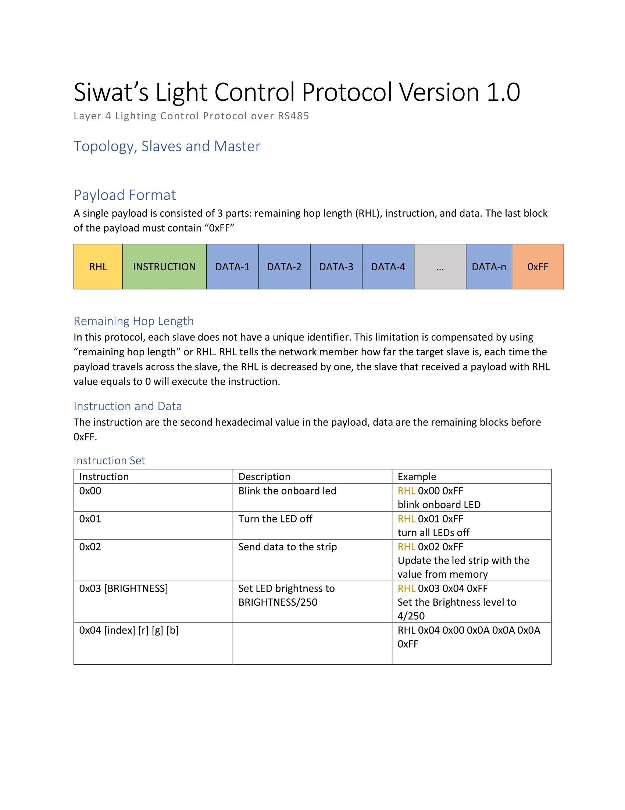

# Siwat's Light Control Protocol (SLCP)
 Set of Python Libraries to interact with LED Controller that uses Siwat's Light Control Protocol and Siwat's Remote Light Control Protocol
 
 

## **SLCP Client Types**

### Serial Line Topology Client

The Serial Line client works by utilizing multiple microcontroller unit connected using a line topology. This allows the entire network to be controlled using only one serial port on the host machine. The wiring for this method required 2 serial port on the controller one for in and one for out. for further information, please refer to the protocol specification. 
**Import and Initialization**

    from siwat_light_control_protocol.siwat_light_control_protocol import siwat_light_control_protocol
    SERIAL_PORT = "COM3" # Change if neccessary
    LED_MAP = [60,30,60]
    leds = slcp(SERIAL_PORT,LED_MAP)
    
### Serial Star Topology Client
The Serial Star client works by connecting multiple controller to the same host computer directly to utilize multiple controller to create one continuous strand of light. 
**Import and Initialization**

    from siwat_light_control_protocol.siwat_light_control_protocol_multi_serial import siwat_light_control_protocol_multi_serial as slcp
    SERIAL_PORTS = ["COM3","COM4","COM5"] # Change if neccessary
    LED_MAP = [60,30,60]
    leds = slcp(SERIAL_PORTS,LED_MAP)

### Remote Client
The Serial remote client works on top of the MQTT protocol, by using JSON packet to transfer data between SLCP Remote Client and SLCP Server. 
**Import and Initialization**

    from siwat_remote_light_control_protocol_client.siwat_remote_light_control_protocol_client import siwat_remote_light_control_protocol_client as srlcp
    MQTT_SERVER  =  "172.16.0.2"
    MQTT_PORT  =  1883
    MQTT_USE_AUTH  =  True
    LIGHT_ADDRESS  =  "/ledstrip"
    MQTT_USERNAME = "username"
    MQTT_PASSWORD = "password"
    leds = srlcp(mqtt_server=MQTT_SERVER, mqtt_port=MQTT_PORT, light_address=LIGHT_ADDRESS,mqtt_use_auth=MQTT_USE_AUTH, mqtt_username=MQTT_USERNAME,mqtt_password=MQTT_PASSWORD)
**Note**

 1. *Lights have to but put in Programming Mode (**Program** Effect)* to allow programming from a remote client, this can be done by calling **enter_programming_mode()**
 2. *mqtt_username* and *mqtt_password* field are not required if *mqtt_use_auth* is *False*

## **SLCP Client Functions**

 1. **show()** | Update the led with the programmed value
 2. **set_led_at(index,r,g,b)** | Program an led at index ***index*** with color r,g,b
 3. **turn_off()** | Turn off all of the leds
 4. **rainbow()** | Activate the controller's built-in rainbow effect **(Not available on Remote Client as it desync the state)**
 5. **fill_led_with_color(r,g,b)** | Set all of the led to color r,g,b
 6. **fill_segment_with_color(segment_start,segment_stop,r,g,b)** | Set all of the light, starting from segment_start to segment_stop to r,g,b
 7. **enter_programming_mode()** | Engage the Programming Functionality of the Controller **(Only available on Remote Client)**

**Note**
 - 0<=r,g,b<=255

## **SLCP Server**
SLCP Server expose the control interface of the controller to MQTT. The sever can be started by executing

    python -m siwat_remote_light_control_protocol_server
This must be done in a directory with ***config.json*** in it.
***config.json*** is a configuration file with the following structure

    {
	    "MQTT_SERVER": "",
	    "MQTT_USE_AUTH": false,
	    "MQTT_USERNAME": "",
	    "MQTT_PASSWORD": "",
	    "MQTT_BASE_TOPIC": "/ledstrip/fixture1",
	    "FRAME_TIME": 0.1,
	    "SERIAL_PORTS_MAP": [
		    "COM1"
        ],
	    "LED_MAP": [
		    60
	    ]
    }
**Note**
MQTT_BASE_TOPIC is the same as LIGHT_ADDRESS

### Basic MQTT Publish Topics
TOPIC | PAYLOAD | Description
 - **MQTT_BASE_TOPIC/control/state** | *"on"*/*"off"* | set the state of the led
 - **MQTT_BASE_TOPIC/control/brightness** | 0-255 | set the brightness of the led
 - **MQTT_BASE_TOPIC/control/color** | r,g,b | set the color of the light to r,g,b where 0<=r,g,b<=255
 - **MQTT_BASE_TOPIC/control/effect** | *effect_name* | set the effect of the led
- **MQTT_BASE_TOPIC/control/exit** | any | exit the program
- **MQTT_BASE_TOPIC/control/requeststate** | resend all report

### Basic MQTT Information Topics
 - **MQTT_BASE_TOPIC/report/state** | *"on"*/*"off"* | current state of the led
 - **MQTT_BASE_TOPIC/report/brightness** | 0-255 | current brightness of the led
 - **MQTT_BASE_TOPIC/report/color** | r,g,b | current color of the led in term of r,g,b where 0<=r,g,b<=255
 - **MQTT_BASE_TOPIC/report/effect** | *effect_name* | current effect of the led
 - **MQTT_BASE_TOPIC/report/effectlist** | *effect1,effect2,effect3,...* | comma-seperated list of effects
 - **MQTT_BASE_TOPIC/report/num_leds** | *num_leds* | integer representing how much led chips the server are conencted to

### MQTT Programming Interface Topics
**MQTT_BASE_TOPIC/control/program** | payload
Where payload is a json array containing the following object

    [index,[r,g,b]]

For Example, *[0,[255,255,255]]* will set the led at index 0 to r,g,b = 255,255,255

The payload that set the light at index 0,1,2 to red,green,blue respectively is then

    [
        [0,[255,0,0]]
        [1,[0,255,0]]
        [2,[0,0,255]]
    ]
